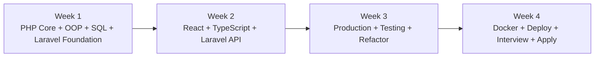
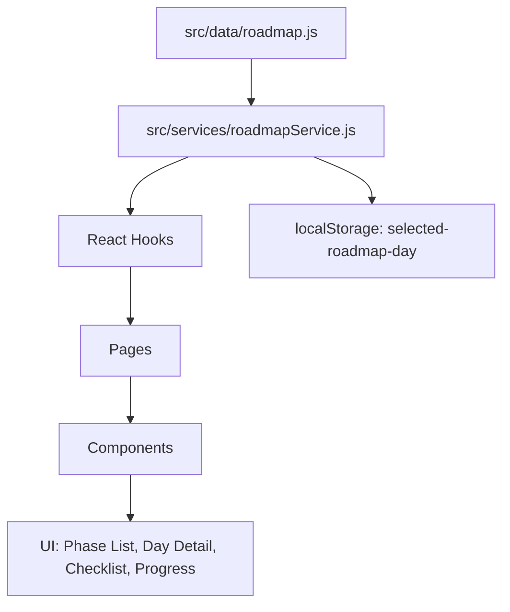
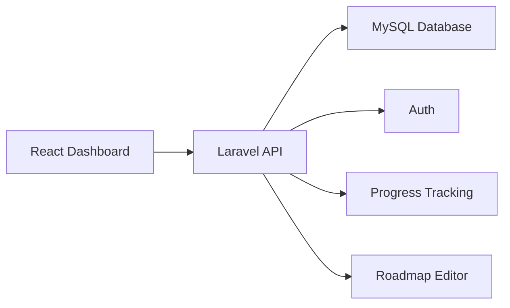

# Core Fullstack PHP Learning

<p align="center">
  
</p>

<h1 align="center">Core Fullstack PHP Learning</h1>

<p align="center">
  30-day rebuild roadmap for PHP, Laravel, React, SQL, Git, Docker, testing, deployment, and junior fullstack job preparation.
</p>

<p align="center">
  
  
  
  
  
</p>

<p align="center">
  
  
  
</p>

---

## Overview

This repository is my 30-day fullstack learning system.

The main goal is not to collect tutorials.  
The goal is to build real output every day:

- runnable code
- meaningful Git commits
- notes and error logs
- README documentation
- API examples
- testing evidence
- final fullstack project
- interview-ready explanations

This repo follows one simple rule:

> Build it. Run it. Break it. Fix it. Commit it. Explain it.

---

## Main Goal

Become job-ready for junior/fresher fullstack roles using:

| Area | Main Focus |
|---|---|
| Backend | PHP, Laravel, REST API |
| Frontend | ReactJS, TypeScript |
| Database | MySQL, SQL, PDO, Eloquent |
| Dev Tools | Git, GitHub, Postman, Docker |
| Quality | Testing, PHPStan, README, API docs |
| Production | Docker, deploy checklist, CI/CD basics |
| Interview | Project walkthrough, technical Q&A, trade-off explanation |

---

## Repository Structure

```txt
core-fullstack-php-learning/
├── README.md
├── .gitignore
├── docs/
│   └── images/
│       └── banner.png
├── tools/
│   └── roadmap-command-center/
├── days/
│   ├── day-01-php-core/
│   ├── day-02-oop-solid/
│   ├── day-03-sql-pdo-docker/
│   ├── day-04-security-rest-auth/
│   ├── day-05-php-hardmode-project/
│   ├── day-06-laravel-core/
│   ├── day-07-laravel-api-testing-blog/
│   ├── day-08-typescript-react-api/
│   ├── day-09-react-query-zustand-auth/
│   ├── day-10-axios-router-auth-flow/
│   ├── day-11-ui-system-admin/
│   ├── day-12-fullstack-admin-day-1/
│   ├── day-13-fullstack-workflow-role-tests/
│   ├── day-14-fullstack-stabilize-ship/
│   ├── day-15-laravel-architecture-clean-boundaries/
│   ├── day-16-testing-hardmode/
│   ├── day-17-docker-fullstack/
│   ├── day-18-queues-cache-events/
│   ├── day-19-import-export-files-reports/
│   ├── day-20-security-performance-observability/
│   ├── day-21-production-boss-refactor-demo/
│   ├── day-22-ci-cd-git-workflow/
│   ├── day-23-deployment-hardmode/
│   ├── day-24-company-mock-task-feature/
│   ├── day-25-company-mock-task-bugfix-review/
│   ├── day-26-portfolio-packaging/
│   ├── day-27-interview-war/
│   ├── day-28-final-boss-demo-apply/
│   ├── day-29-mail-notification-broadcasting/
│   └── day-30-final-ship-polish/
└── final-project/
    ├── backend/
    ├── frontend/
    ├── docs/
    ├── postman/
    └── screenshots/
```

---

## Roadmap Phases



---

## 30-Day Learning Roadmap

| Day | Folder | Focus | Status |
|---:|---|---|---|
| 01 | `day-01-php-core` | PHP core, CLI, variables, types, control flow, arrays | Planned |
| 02 | `day-02-oop-solid` | OOP, encapsulation, interface, abstract, SOLID | Planned |
| 03 | `day-03-sql-pdo-docker` | SQL, MySQL Docker, PDO, index, transaction | Planned |
| 04 | `day-04-security-rest-auth` | Security, REST API, auth, token, validation | Planned |
| 05 | `day-05-php-hardmode-project` | Pure PHP API project, service/repository, docs | Planned |
| 06 | `day-06-laravel-core` | Laravel route, controller, Eloquent, container | Planned |
| 07 | `day-07-laravel-api-testing-blog` | Laravel API, feature tests, API docs | Planned |
| 08 | `day-08-typescript-react-api` | TypeScript mindset for React + Laravel API | Planned |
| 09 | `day-09-react-query-zustand-auth` | Server state, client state, auth store | Planned |
| 10 | `day-10-axios-router-auth-flow` | Axios, router, protected routes, auth flow | Planned |
| 11 | `day-11-ui-system-admin` | UI system, admin layout, reusable components | Planned |
| 12 | `day-12-fullstack-admin-day-1` | Laravel + React admin integration | Planned |
| 13 | `day-13-fullstack-workflow-role-tests` | Roles, workflow, testing, access control | Planned |
| 14 | `day-14-fullstack-stabilize-ship` | Stabilize, bugfix, demo, ship week 2 | Planned |
| 15 | `day-15-laravel-architecture-clean-boundaries` | Architecture, services, clean boundaries | Planned |
| 16 | `day-16-testing-hardmode` | Unit tests, feature tests, test strategy | Planned |
| 17 | `day-17-docker-fullstack` | Dockerize backend, frontend, database | Planned |
| 18 | `day-18-queues-cache-events` | Queue, cache, events, notifications base | Planned |
| 19 | `day-19-import-export-files-reports` | Import/export, file handling, reports | Planned |
| 20 | `day-20-security-performance-observability` | Security audit, performance, logs | Planned |
| 21 | `day-21-production-boss-refactor-demo` | Production refactor and demo readiness | Planned |
| 22 | `day-22-ci-cd-git-workflow` | Git workflow, branches, PR mindset, CI/CD | Planned |
| 23 | `day-23-deployment-hardmode` | Deployment, environment, production checklist | Planned |
| 24 | `day-24-company-mock-task-feature` | Company-style feature task | Planned |
| 25 | `day-25-company-mock-task-bugfix-review` | Bugfix, review, refactor, pull request style | Planned |
| 26 | `day-26-portfolio-packaging` | Portfolio docs, screenshots, project story | Planned |
| 27 | `day-27-interview-war` | Mock interview, Q&A, project walkthrough | Planned |
| 28 | `day-28-final-boss-demo-apply` | Final demo, apply package, next roadmap | Planned |
| 29 | `day-29-mail-notification-broadcasting` | Mail, notification, broadcasting extension | Planned |
| 30 | `day-30-final-ship-polish` | Final polish, README, screenshots, release | Planned |

---

## Daily Definition of Done

A day is not done just because the code exists.

Each day must have:

- [ ] code that runs on my machine
- [ ] clear README or notes
- [ ] errors and fixes recorded
- [ ] meaningful commit messages
- [ ] output evidence: screenshot, curl response, test result, or demo
- [ ] short reflection
- [ ] at least one interview-style explanation

No fake progress.  
No random folder dump.  
No `update` commit messages.

---

## Daily Workflow

```bash
cd ~/Code/core-fullstack-php-learning

git status
git add .
git commit -m "day xx topic name"
git push
```

Good commit examples:

```bash
git commit -m "day 01 practice php variables and validation"
git commit -m "day 03 implement pdo transaction and sql reports"
git commit -m "day 06 build laravel project crud with service layer"
git commit -m "day 09 add react query hooks for project api"
git commit -m "docs: add day 14 fullstack demo notes"
```

Bad commit examples:

```bash
git commit -m "update"
git commit -m "fix"
git commit -m "code"
git commit -m "abc"
```

---

## Roadmap Command Center

The folder below is a helper tool, not a learning day:

```txt
tools/roadmap-command-center/
```

It is planned as a React/Vite dashboard for rendering the roadmap data visually.

### Purpose

The Roadmap Command Center will help track:

- phases
- days
- current selected day
- progress per phase
- previous/next day navigation
- daily time blocks
- checklist
- benchmark
- status: `doing`, `done`, `not-started`

### Service Layer

The roadmap service is designed to keep data logic away from UI components.

```txt
src/services/roadmapService.js
```

Core functions:

| Function | Purpose |
|---|---|
| `getRoadmap()` | Return the whole roadmap object |
| `getDays()` | Return all learning days |
| `getPhases()` | Return all roadmap phases |
| `getPhasesWithDays()` | Attach days to each phase and calculate progress |
| `getDayById(dayId)` | Find one day by id |
| `getDayIndex(dayId)` | Find day index for navigation |
| `getAdjacentDays(dayId)` | Return previous and next day |
| `getInitialDayId()` | Load saved day from localStorage, fallback to doing day, then first day |
| `saveSelectedDay(dayId)` | Save selected day to localStorage |

### LocalStorage Key

```txt
selected-roadmap-day
```

The dashboard can remember the last selected day after browser reload.

### Data Flow



### Why Service Layer?

Because components should not be full of data-processing logic.

Bad idea:

```txt
Component calculates phase progress, filters days, handles localStorage, finds next day, and renders UI.
```

Better idea:

```txt
Data layer stores roadmap.
Service layer processes roadmap.
Hook manages state.
Component renders UI.
```

This makes the dashboard easier to maintain and easier to replace with a Laravel API later.

---

## Future Fullstack Upgrade

The current roadmap command center can start with mock data.

Later it can become a real fullstack app:



Possible API endpoints:

```txt
GET    /api/roadmap
GET    /api/phases
GET    /api/days
GET    /api/days/{id}
PATCH  /api/days/{id}/status
POST   /api/days/{id}/reflection
```

---

## Final Project Target

The final project will be a fullstack Laravel + React application.

```txt
final-project/
├── backend/       # Laravel REST API
├── frontend/      # React frontend
├── docs/          # architecture, setup, notes
├── postman/       # API collection
└── screenshots/   # UI/API demo images
```

Expected features:

- authentication
- role-based access control
- CRUD features
- validation
- filtering/search/pagination
- API resources
- testing
- Docker setup
- API documentation
- deployment notes

---

## Screenshots

> Screenshots will be added when UI/API output is ready.

<p align="center">
  
</p>

---

## Evidence Checklist

Each serious project day should include at least one evidence item:

| Evidence Type | Example |
|---|---|
| Git history | `git log --oneline` |
| API output | curl response or Postman screenshot |
| Test output | `php artisan test`, `npm test` |
| UI screenshot | page screenshot in `screenshots/` |
| Docs | setup guide, API docs, architecture notes |
| Reflection | what went wrong, what got fixed |

---

## Current Progress

```txt
Progress: Day 00 / 30
Mode: Rebuild from foundations
Main stack: PHP/Laravel + React
Goal: Junior Fullstack Developer readiness
```

---

## Author

**Ngoc Le Viet**

```txt
GitHub: levietngocc
Focus: PHP, Laravel, ReactJS, SQL, Fullstack Web Development
OS: Linux / Pop!_OS
Learning Mode: Hard mode, output-first, production mindset
```

---

## Motto

> Learn the fundamentals. Build real output. Commit evidence. Explain like a developer.
